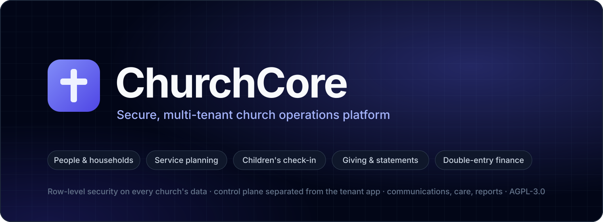
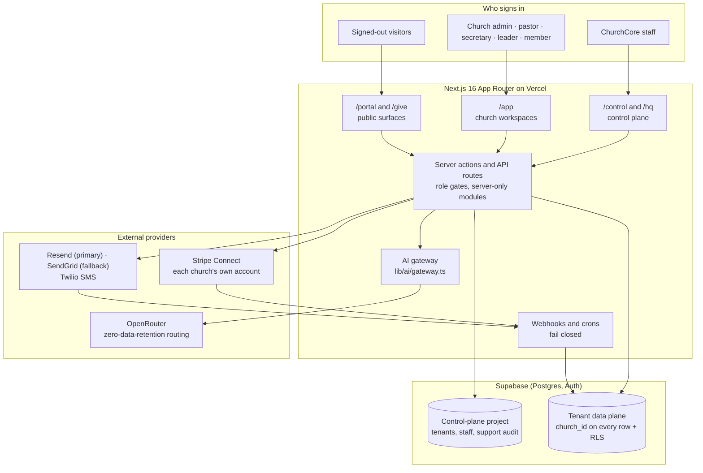
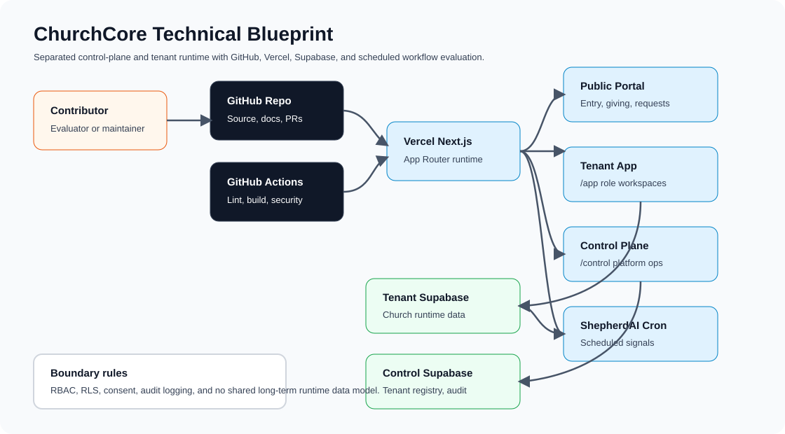
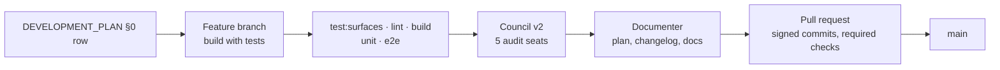

<!-- markdownlint-disable MD001 MD036 MD041 -->
<div align="center">



# ChurchCore

### Secure, Multi-Tenant Church Operations Platform

**Built for church administrators, pastors, office staff, ministry leaders, volunteers and members**

[](./LICENSE)
[](./CHANGELOG.md)
[](https://nextjs.org)
[](https://react.dev)
[](https://www.typescriptlang.org)
[](https://mantine.dev)
[](https://supabase.com)
[](./.github/workflows/ci.yml)
[](./improve-software.md)

**[🌐 www.churchcore.io](https://www.churchcore.io)**

[Quick Start](#-quick-start) · [HOWTO](./HOWTO.md) · [Contributing](./CONTRIBUTING.md) · [Security](./SECURITY.md) · [Support](./SUPPORT.md) · [Versioning](./VERSIONING.md) · [Docs Hub](./docs/README.md) · [Changelog](./CHANGELOG.md)

</div>

<!-- markdownlint-enable MD001 MD036 MD041 -->

---

## 💡 Why This Exists

A church runs on more than a member list. In a single week its staff plan services and rosters, check children in and out safely, take gifts, keep the books, message the congregation, and care for people in confidence. Most churches spread that work across several tools, each with its own copy of the people data.

**ChurchCore** puts that work on one platform, with every church's data isolated from every other church's:

- **People and ministry:** members, households, ministries, groups, events and registrations, and a weekly readiness path for the church admin.
- **Sunday operations:** service plans with setlists and a song library, volunteer rotation with blockout dates, and children's check-in with PIN/QR pickup and custody restrictions.
- **Stewardship:** online and recurring giving on each church's own Stripe account, year-end statements, and a double-entry general ledger that giving posts into.
- **Care and communication:** pastoral notes encrypted at rest, consent- and suppression-aware email and SMS, and reports for leadership.
- **Assistive AI, not autopilot:** deterministic ShepherdAI workflow suggestions and AI ministry tools that keep a person in the loop.

ChurchCore is part of a product family with **ChurchCore Care** (Christian counseling workflows) and **ChurchCore Academy** (Christian LMS and administration).

> **MVP status:** readiness **89/100** (Council Review 44, 2026-10-06), MVP target **November 6, 2026**. Milestones M1 and M2 are met, and Gaps 1, 3 and 5 are closed. All open work is tracked in [`DEVELOPMENT_PLAN.md` §0](./DEVELOPMENT_PLAN.md#0-mvp-roadmap-to-november-6-2026-tracker). Summary: [docs/roadmap.md](./docs/roadmap.md).

---

## 🧭 Capabilities by Module

| Module | What it covers | Main routes |
| :--- | :--- | :--- |
| **👥 People & households** | Search, filter, bulk update, household reassignment, duplicate merge, account-request approval, member directory and family views | `/app/church-admin/people`, `/app/church-admin/accounts`, `/app/member/directory` |
| **📅 Events & registrations** | Categorized calendar (month/week/day), RSVP, rosters and check-in, public and member registration with card payment | `/app/calendar`, `/app/church-admin/events`, `/portal/events/register` |
| **🎵 Service planning & volunteers** | Song library and setlists, role taxonomy and roster, fatigue-aware rotation planner, blockout dates, assignment notifications | `/app/church-admin/volunteers/schedules`, `/app/church-admin/volunteers/role-types`, `/app/member/schedule` |
| **🧒 Children's ministry** | Check-in and checkout kiosks, family self check-in kiosk mode (phone, family code or QR, 60 s idle reset, 6-digit exit PIN), rooms and ratios, PIN/QR pickup, custody restrictions, emergency roster, incidents | `/app/church-admin/children/*`, `/kiosk/children`, `/portal/children/*` |
| **💳 Giving** | One-time and recurring gifts on the church's own Stripe account (Connect, Standard, direct charges, no platform fee), public giving page, receipts, year-end statements | `/app/member/giving`, `/app/church-admin/giving`, `/give/[slug]` |
| **📒 Finance** | Chart of accounts, journals (draft → posted → voided), budgets and variance, CSV/Excel/IIF/OFX import, income statement and balance sheet | `/app/church-admin/finance/*` |
| **✉️ Communications** | Segmented email and SMS, scheduling, templates, history with retry and failure reasons, suppressions; Resend primary, SendGrid fallback, Twilio SMS | `/app/communications/*` |
| **🙏 Pastoral care** | Pastor-only notes and care assignments, Elders Discernment Room, Council Forge | `/app/pastor/people`, `/app/elders/discernment`, `/app/council/forge` |
| **📊 Reports** | Member, event and giving dashboards for pastors and church admins | `/app/reports/*`, `/app/giving` |
| **🤖 ShepherdAI & AI tools** | Deterministic workflow suggestions from church signals; Bible Study Q&A and sermon-outline assist, consent-gated and logged | `/app/church-admin/workflows`, `/app/pastor/bible-study` |
| **📥 Migration** | Dry-run and commit imports for people, groups (including Breeze Tags), events, attendance and giving, reading Planning Center and Breeze CSV exports (formats partly unverified), then a reconciliation report per import with a minimal CSV download | `/app/church-admin/*/import`, `/app/church-admin/imports/[batchId]` |
| **🛠️ Platform operations** | Control plane for ChurchCore staff (tenants, provisioning, launch checklist, demo feedback); Project HQ with an AI advisor and in-app Council | `/control`, `/hq` |

The full route map and per-feature notes are in [docs/application-surface.md](./docs/application-surface.md), and a guided product walkthrough is in [docs/application-guide.md](./docs/application-guide.md).

---

## 🏗️ Architecture & Topology

ChurchCore keeps a hard boundary between **platform operations** and **church runtime data** ([ADR 0002](./docs/adr/0002-control-plane-and-tenant-separation.md)). Inside the tenant data plane, every church's rows carry a `church_id` and **PostgreSQL Row-Level Security** is the enforcement boundary ([tenant data segmentation](./docs/tenant-data-segmentation.md)).



- **Control plane vs. tenant app:** `/control` is for ChurchCore staff only; `/app` is the church runtime. Each has its own Supabase auth surface and project. See [docs/control-plane.md](./docs/control-plane.md).
- **Payments:** each church connects its own Stripe account; every call for that church's money carries `Stripe-Account`, so the church is merchant of record ([ADR 0025](./docs/adr/0025-stripe-connect-standard-direct-charges.md)).
- **AI:** every LLM call goes through one server-only gateway to OpenRouter, with PII scrubbing and zero-data-retention routing that fails closed ([ADR 0027](./docs/adr/0027-openrouter-ai-gateway.md)).
- **Design system:** dark-first slate surfaces, indigo primary and Inter, delivered through the Mantine theme ([ADR 0026](./docs/adr/0026-churchcore-design-system-parity.md)).

Start with [docs/architecture.md](./docs/architecture.md); the full diagram set is in [docs/diagrams.md](./docs/diagrams.md).

<details>
<summary>System architecture diagram (SVG)</summary>



</details>

---

## 🚀 Quick Start

### Prerequisites

- **Node.js 22.13.0** or newer (see `.nvmrc`) and **npm**
- **Docker** for the local Supabase backend (optional for preview mode)

### 1. Clone & Install

```bash
git clone https://github.com/ricardojjulia/ChurchCore.git
cd ChurchCore
npm ci
```

### 2. Run in Preview Mode

```bash
npm run dev
```
Open **[http://localhost:4200](http://localhost:4200)**. Without backend environment variables the app runs in preview mode with in-memory demo data.

### 3. Add the Local Supabase Backend

```bash
cp .env.example .env.local   # fill Supabase keys from: npx supabase status --output env
npm run setup:local          # starts Supabase, resets and migrates the DB, seeds Grace Harbor Church
npm run dev
```
Demo credentials are generated into the gitignored `.demo-credentials.local`. Environment variables, the e2e stack, scripts and troubleshooting are in **[HOWTO.md](./HOWTO.md)**.

---

## 🎬 Try the Demo

The app is live at **[www.churchcore.io](https://www.churchcore.io)** (the same production deployment also answers at [church-core-ops.vercel.app](https://church-core-ops.vercel.app)) — no installation required.

**All demo accounts use the password: `ChurchCoreDemo2026!`**

| Role | Email | Access |
| :--- | :--- | :--- |
| Church Administrator | `admin@graceharbor.church` | Full dashboard, readiness, finance, reports, settings |
| Secretary / Office Admin | `secretary@graceharbor.church` | Daily desk, task queue, account approvals, calendar |
| Pastor / Elder | `pastor@graceharbor.church` | Care assignments, pastoral notes, ministry oversight |
| Ministry Leader | `leader@graceharbor.church` | Ministry Forge, volunteer scheduling, service plan |
| Member / Volunteer | `member@graceharbor.church` | Member portal, giving history, groups, events |

The demo church is **Grace Harbor Church**, with pre-seeded data across all modules. A guided 30-minute tour is in [docs/setup/demo-install.md](./docs/setup/demo-install.md).

> **Demo mode is for demos only.** A demo deploy runs with `NEXT_PUBLIC_DEMO_MODE=true`, which enables the demo-only `/api/demo/*` routes and lets provider stubs report payments and messages as succeeded when Stripe or email/SMS keys are missing (`lib/stub-mode.ts`). A deploy that serves a real church must leave it unset — see [docs/setup/production-deployment.md](./docs/setup/production-deployment.md).

---

## 🧪 Quality Gates

Every change ships its tests, and CI blocks the merge:

```bash
npm run test:surfaces   # every page, API route and server action is in tests/coverage-manifest.json with real tests
npm run lint            # ESLint
npm run build           # type-checked production build
npm run test            # Vitest unit suite
npm run test:e2e:local  # full Playwright suite against local Supabase, as CI runs it
```

| Gate | Where | What it checks | Blocks merge |
| :--- | :--- | :--- | :---: |
| **Surface manifest** | CI `verify` · `npm run test:surfaces` | No unregistered, stale or untested page, API route or server action | ✅ |
| **Lint, typecheck, build** | CI `verify` · `npm run check` | ESLint, `tsc --noEmit`, `next build` | ✅ |
| **Unit tests** | CI `verify` · `npm run test` | Vitest suite | ✅ |
| **RLS audit and DB tests** | CI `verify` · `npm run audit:rls`, `npm run test:db` | No `church_id` table without RLS; real-Postgres tests on a fresh local Supabase | ✅ |
| **End-to-end** | CI `e2e` (4 shards) · `npm run test:e2e:local` | Every page × every role, every API route, key journeys, server-reference check | ✅ |
| **Security scans** | CodeQL, gitleaks, dependency review | Code scanning, committed secrets, vulnerable dependencies on PRs | — |
| **The Council** | [`improve-software.md`](./improve-software.md) | 5 read-only audit seats (data/API, routes, UX, feature, security) + Documenter, before every non-trivial merge | Mandate |
| **Verified signatures** | Branch protection on `main` | Every commit signed and from a verified email | ✅ |

`verify` and the four `e2e` shards are the required status checks on `main` (a repository setting; see [docs/testing.md](./docs/testing.md)).

---

## 🤖 AI-Assisted Software Factory

ChurchCore is built with a documented, repo-local software factory for Claude Code (`.claude/`), Codex (`.codex/`) and Gemini (`.gemini/`): feature planning, build-with-tests, PR review, the Council and the Testing Council. Every meaningful run leaves its intent, verification and residual risk in [`docs/factory-runs/`](./docs/factory-runs/) and [`docs/reviews/`](./docs/reviews/).



How to use it: [docs/software-factory.md](./docs/software-factory.md). Portable Council and Project HQ spec: [docs/council-and-hq-portable.md](./docs/council-and-hq-portable.md).

---

## 📚 Documentation & Governance

- 📘 **[HOWTO](./HOWTO.md)** — Local setup, environment variables, local Supabase, tests, scripts and troubleshooting.
- 🧭 **[Documentation Hub](./docs/README.md)** — Categorized index of everything in `docs/`.
- 📐 **[Architecture](./docs/architecture.md)** — Control plane, tenant data plane, RLS, providers and the AI gateway.
- 📜 **[Architecture Decision Records](./docs/adr/)** — ADR 0001–0028.
- 🗺️ **[Roadmap](./docs/roadmap.md)** — Milestones to the November 6 MVP and what comes after.
- 📋 **[Development Plan](./DEVELOPMENT_PLAN.md)** — Source of truth for scope, stack, the §0 tracker and release discipline.
- 🧪 **[Testing](./docs/testing.md)** — The surface manifest, the e2e suite and CI.
- 🏛️ **[Council Protocol](./improve-software.md)** and **[Agent Rules](./AGENTS.md)** — Review mandates and repository rules.
- 🛡️ **[Security Policy](./SECURITY.md)** — Supported versions, security boundaries and private reporting.
- 🤝 **[Contributing](./CONTRIBUTING.md)** — Branches, signed commits, test surfaces and migrations.
- 🏷️ **[Versioning](./VERSIONING.md)** — SemVer classes and release discipline.
- ✅ **[Release Checklist](./RELEASE_CHECKLIST.md)** — Pre-merge, pre-release and post-deploy gates.
- 📝 **[Changelog](./CHANGELOG.md)** — Release history, including every release's highlights.
- 💬 **[Support](./SUPPORT.md)** · 🤲 **[Code of Conduct](./CODE_OF_CONDUCT.md)**

---

## ⚖️ License

ChurchCore is licensed under the **GNU Affero General Public License v3.0 (AGPL-3.0-only)**. See [LICENSE](./LICENSE).
