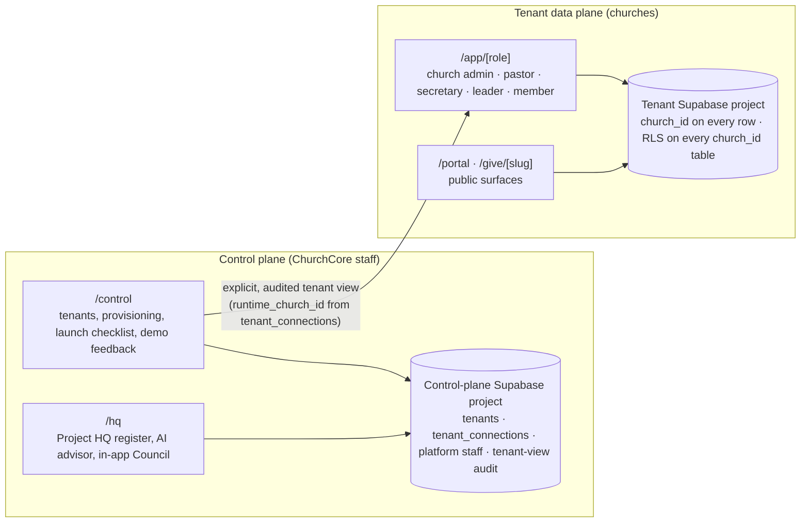
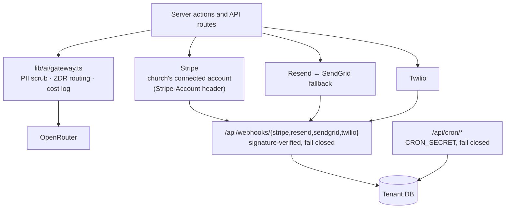

# Architecture

The entry point to ChurchCore's architecture. It summarizes the shape of the system and links to the documents and ADRs that hold the detail.

---

## 1. Technical Blueprint

ChurchCore is built around a hard boundary between platform operations and church runtime data:

- **Control plane:** ChurchCore staff surface for tenant lifecycle, billing metadata, platform staff identity, support audit, and provisioning.
- **Tenant app:** Church-facing runtime for admins, pastors, secretaries, ministry leaders, volunteers, members, and public portal visitors.
- **Data boundary:** Control-plane and tenant data live in separate Supabase projects. Cross-boundary support access must be explicit, audited, and intentionally designed.
- **Workflow intelligence:** ShepherdAI is Ops-only and deterministic-first. It recommends ministry workflows from signals; it is not a chatbot and does not replace pastoral discernment.

- **Request path:** Next.js 16 App Router pages call server actions and API routes. A module whose exports take a trusted session or tenant id is `import "server-only"`; only a module that authenticates its own caller is `"use server"` ([ADR 0022](adr/0022-communications-compliance-lookups-admin-client.md)).
- **Tenancy inside the tenant plane:** every data table carries `church_id`, and PostgreSQL RLS composes from `is_platform_admin()`, `belongs_to_church()` and `can_manage_church()`, which read `auth.uid()` — see [tenant-data-segmentation.md](tenant-data-segmentation.md). `npm run audit:rls` blocks CI if a `church_id` table lacks RLS.
- **`SECURITY DEFINER` functions** take their actor from `auth.uid()`, never an argument ([ADR 0024](adr/0024-security-definer-actor-from-auth-uid.md)).

> **Two documents, two models.** [tenant-data-segmentation.md](tenant-data-segmentation.md) (updated 2026-09-18) describes the current model: churches share the tenant database and are isolated by `church_id` and RLS. [cloud-architecture.md](cloud-architecture.md) (2026-04-17) describes a recommended per-church "silo" deployment (one Supabase project per church). ADR 0002 allows either for the tenant plane; what is fixed is the separation between the control plane and tenant data.

---

## 2. Stack

- Next.js 16 App Router with TypeScript, React 19
- Mantine UI (Mantine 9) and Tailwind CSS v4
- Supabase (Postgres, Auth) for split control-plane and tenant data surfaces
- Stripe Connect for giving and paid registrations (Standard accounts, direct charges)
- Resend (primary) and SendGrid (fallback) for email, Twilio for SMS
- OpenRouter AI gateway, with direct Anthropic as the backup
- Sentry for error reporting
- GitHub Actions for verify, e2e, CodeQL, dependency review, and secret scanning
- Vercel hosting with scheduled cron routes (ShepherdAI evaluation, communications retry and scheduled sends)

---

## 3. External Providers and Boundaries

| Concern | Rule | Source |
| :--- | :--- | :--- |
| Payments | Each church connects its own Stripe account; no platform fallback and no platform fee | [ADR 0025](adr/0025-stripe-connect-standard-direct-charges.md) |
| Webhooks | Unset secret → every request rejected; providers' real signature schemes verified | [runbooks/communications.md](runbooks/communications.md), [setup/production-deployment.md](setup/production-deployment.md) |
| Provider stubs | A stub may report success only outside production or in demo mode (`lib/stub-mode.ts`) | [setup/production-deployment.md](setup/production-deployment.md) |
| Email | Resend primary, SendGrid fallback, one idempotency key per message | [ADR 0006](adr/0006-email-provider-resend.md) |
| AI | One server-only gateway, PII scrubbing, zero-data-retention routing that fails closed | [ADR 0027](adr/0027-openrouter-ai-gateway.md) |
| Pastoral data | Selected pastoral fields encrypted at rest with AES-256-GCM (`lib/crypto/pastoral.ts`, `PASTORAL_ENCRYPTION_KEY`) | [setup/production-deployment.md](setup/production-deployment.md) |
| Volunteer shift times | Stored as church wall-clock time | [ADR 0023](adr/0023-volunteer-shift-wall-clock-times.md) |

---

## 4. Architecture Notes

- ADR 0002 now makes separate control-plane and tenant databases the target architecture and the active configuration path.
- Control-plane registry data belongs in the control-plane project; church runtime data belongs in the tenant project.
- ADR 0001 is now accepted in favor of Supabase with Postgres, Auth, Realtime, and Storage.
- ADR 0002 is now accepted in favor of separating control-plane and tenant data boundaries, including separate databases.
- The current repo establishes the frontend shell, Supabase SSR auth foundation, boundary-aware control-plane and tenant data access wrappers, member portal, live calendar read path, initial multi-tenant schema scaffold, design system baseline, and release discipline expected for future feature work across RBAC portals, ministry operations, calendar workflows, and AI-assisted features.
- Route-segment recovery: `app/{app,portal,control}/loading.tsx` render a shared `PageLoadingSkeleton` during server-side data fetches, and `app/{app,portal,control}/error.tsx` render a shared `PageErrorBoundary` (Sentry-reported, retryable via Next's `reset()`) for runtime errors at those three roots. A root `app/global-error.tsx` still catches anything that escapes all of the above, including errors in the root layout itself.
- Communications retry: the retry cron and the operator's per-row Retry button both go through the same exported `attemptRetry()` (`lib/communications/retry-eligible.ts`), which claims the attempt — a guarded `retry_count` increment — before dispatch, then dispatches with `recordLog: false` and records the outcome on the original `communication_logs` row, so a retry never creates a second retry-eligible row and two overlapping attempts can't both send. A message is dead-lettered to `communication_dlq` once its 3-attempt budget is spent or it fails with a non-transient code, and only after the source-row update succeeds. Known gap: no code path currently selects Resend or maps SendGrid/Twilio failures to a transient error code in production, so this pipeline currently receives no real input — see `docs/adr/0006-email-provider-resend.md`'s implementation-status note and `DEVELOPMENT_PLAN.md`.
- Communications compliance lookups (ADR 0022): `findSuppression`, `checkOptIn`, `communication_logs` writes, `resolveRecipients`, and the compose parent-log insert all use the admin (service-role) client, explicitly scoped by `church_id` from the server-side session or a DB row — never the cookie-bound client, whose RLS visibility depends on who (or what) is calling. This is what lets crons (no user session) and secretary sends (outside `can_manage_church`) get correct suppression/consent answers and write their own audit rows; it is also why scheduled broadcasts can actually deliver on Supabase. **Rule:** a module whose exported functions take a trusted `session` or tenant id as an argument must be `import "server-only"`, never `"use server"` — a `"use server"` export is a POST-callable endpoint reachable by anyone holding its (encrypted, build-rotated) action ID, and one that trusts a caller-supplied session/tenant id can be made to act as any church. Only a module whose exports authenticate their own caller (`requireChurchSession` plus a role check) may be `"use server"`.
  - **RLS boundary on the three communications tables (S1, Council Review 28):** `communication_logs`, `communication_delivery_events`, and `communication_suppressions` grant `authenticated` **reads only** — church admin, pastor, and secretary, via `can_manage_communications`, matching the `/app/communications/*` page gates — and **no insert policy at all**. Every writer (queue, send, compose, cancel, suppress, unsubscribe, and the retry and scheduled crons) goes through the church-scoped admin client above; mapping insert to the readers' roles would let a secretary fabricate logs, delivery events, or suppressions directly through PostgREST.
  - **Cancel and the scheduled cron share the same claim semantics.** `cancelScheduledMessageAction` updates `communication_logs` through the admin client with `status = 'scheduled'` as a condition and checks the row count, failing ("already being sent") instead of silently succeeding if it loses the race with the cron. The scheduled-send cron claims each row the same way (`scheduled` → `sending`, conditioned on `status = 'scheduled'`) and now checks that the claim actually changed a row before dispatching — skipping it otherwise — so a message cancelled between the cron's fetch and its claim, or claimed by an overlapping run, is no longer sent anyway.

> Note added 2026-10-06: the "Known gap" in the communications-retry note above predates G5.1 (#188), which made Resend live and mapped provider failures to shared retry codes. See [ADR 0006](adr/0006-email-provider-resend.md) and the CHANGELOG.

---

## 5. Further Reading

| Document | Purpose |
| :--- | :--- |
| [control-plane.md](control-plane.md) | The `/control` surface: purpose, routes, live data path, provisioning |
| [tenant-data-segmentation.md](tenant-data-segmentation.md) | How church data is isolated with `church_id` and RLS |
| [cloud-architecture.md](cloud-architecture.md) | Recommended production cloud topology, regions, hosting costs |
| [security-role-access-matrix.md](security-role-access-matrix.md) | Sensitive routes and actions by role, with test evidence |
| [security-assessment.md](security-assessment.md) | Security and privacy assessment |
| [diagrams.md](diagrams.md) | Mermaid diagrams with SVG companions |
| [development-plan-visual.md](development-plan-visual.md) | Visual companion to the development plan |
| [adr/](adr/) | ADR 0001–0027 |
