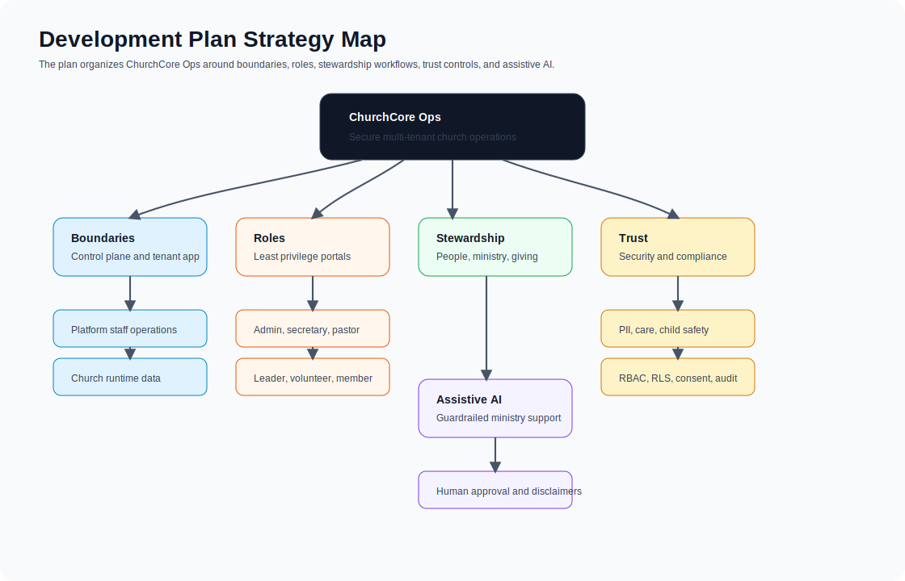
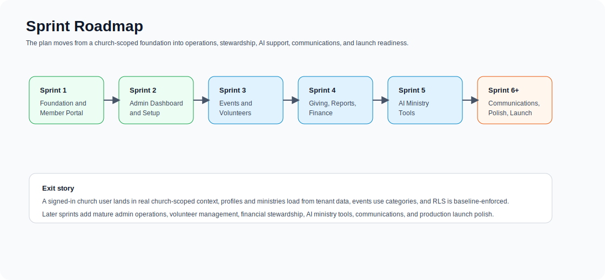
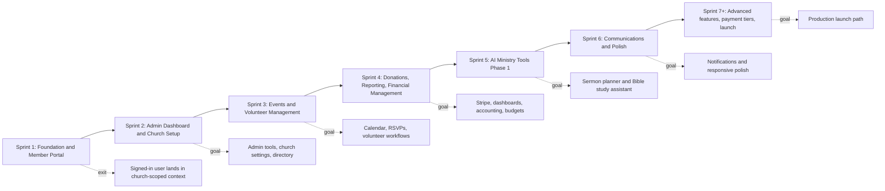
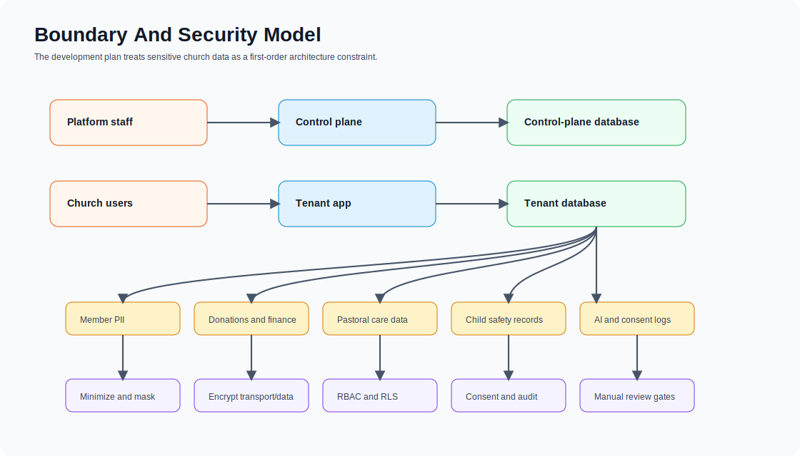
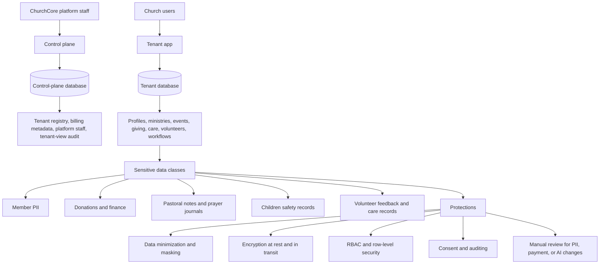
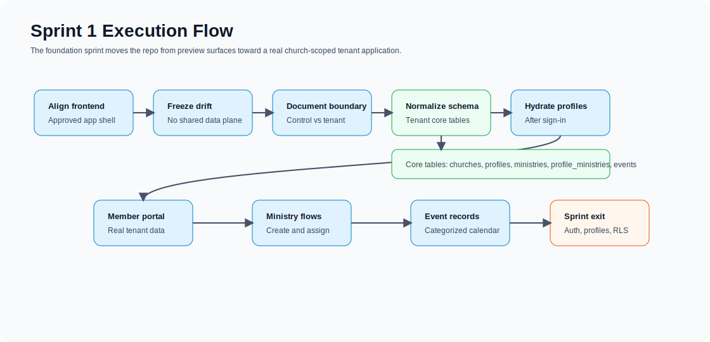
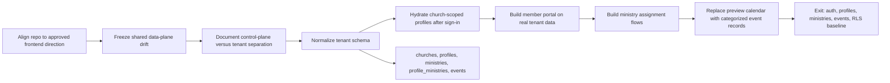

# ChurchCore Visual Development Plan

This is the visual companion to [DEVELOPMENT_PLAN.md](../DEVELOPMENT_PLAN.md). The written plan remains the source of truth for scope, stack, security posture, roadmap, and release discipline.

Static SVG companions live in `docs/assets/diagrams/` for contexts where Mermaid rendering is unavailable.

## Product Strategy Map

```mermaid
flowchart TB
  vision[ChurchCore: secure multi-tenant church operations] --> boundaries[Separated control plane and tenant app]
  vision --> roles[Role-based portals]
  vision --> stewardship[Ministry and operational stewardship]
  vision --> trust[Security, privacy, consent, and audit]
  vision --> ai[Assistive AI with theological guardrails]

  boundaries --> control[Control plane: platform staff, tenant lifecycle, billing metadata, support audit]
  boundaries --> tenant[Tenant app: church admins, pastors, secretaries, leaders, members]

  roles --> super[SuperAdmin]
  roles --> admin[ChurchAdmin]
  roles --> secretary[Secretary / Office Admin]
  roles --> pastor[Pastor / Elder]
  roles --> leader[MinistryAdmin / Leader]
  roles --> member[Volunteer / Member]

  stewardship --> members[Members, families, attendance]
  stewardship --> ministries[Ministry Forge and specialized pathways]
  stewardship --> calendar[Calendar, events, RSVP, volunteers]
  stewardship --> giving[Giving, finance, reports]
  stewardship --> comms[Email and SMS communications]

  trust --> pii[PII and PHI-adjacent care data]
  trust --> rls[RBAC and RLS]
  trust --> consent[Consent and user data rights]
  trust --> appsec[SAST, SCA, DAST, secrets, OWASP]

  ai --> sermon[Sermon planning]
  ai --> bible[Bible study]
  ai --> prayer[Prayer journals and send-outs]
  ai --> workflow[Ops-only workflow recommendations]
```

## Roadmap Flow

## Boundary And Security Model

## Sprint 1 Execution Flow

## How To Use This Visual Plan

- Use [DEVELOPMENT_PLAN.md](../DEVELOPMENT_PLAN.md) for exact requirements, release discipline, and implementation constraints.
- Use this visual companion when orienting contributors, reviewers, or evaluators.
- Update this file whenever plan sections change enough that the strategy, roadmap, boundary model, or Sprint 1 flow would be misleading.
