# ChurchCore Diagrams

These diagrams are the canonical visual reference for the repository. The Mermaid blocks are the source of truth because GitHub renders them natively and they stay easy to review in pull requests.

Static SVG companions live in `docs/assets/diagrams/` for contexts where Mermaid rendering is unavailable.

For the visual companion to the development plan, see [docs/development-plan-visual.md](development-plan-visual.md).

For the AI-assisted workflow guide, see [docs/software-factory.md](software-factory.md).

## System Architecture

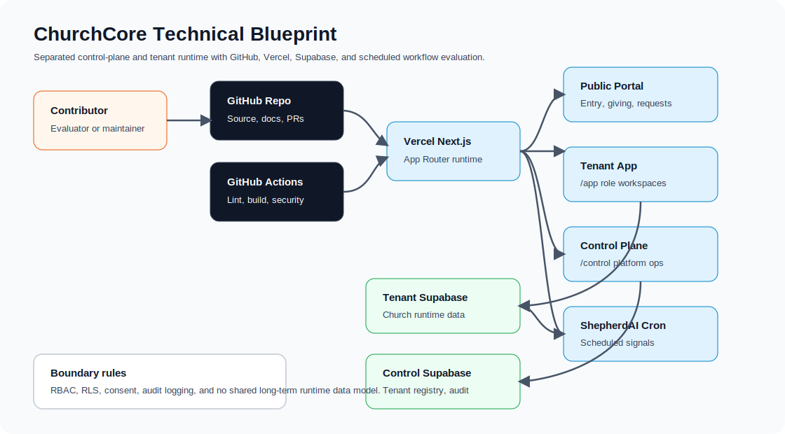

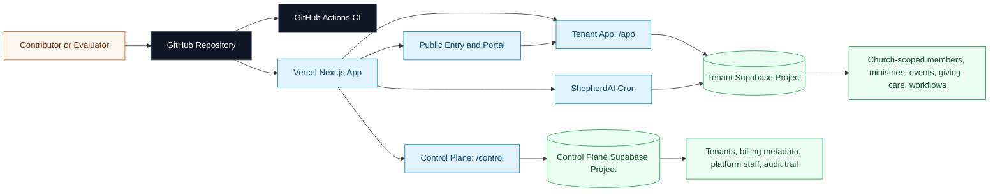

## Role And Surface Map

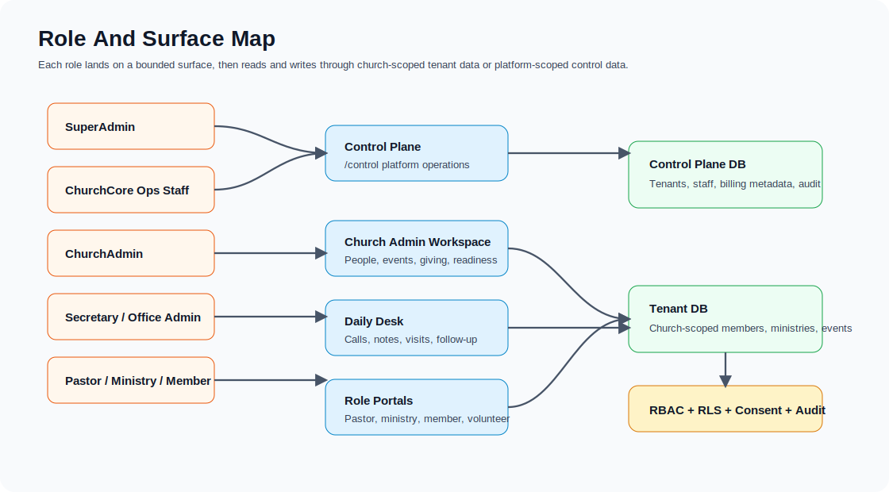

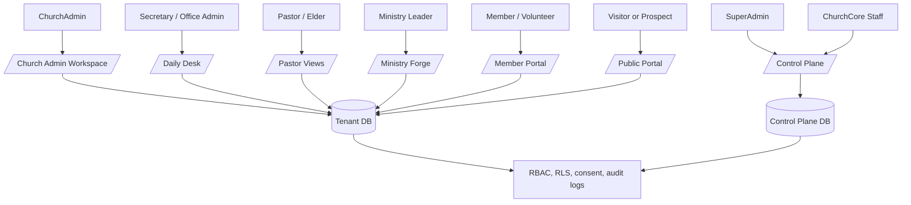

## Core Workflow Map

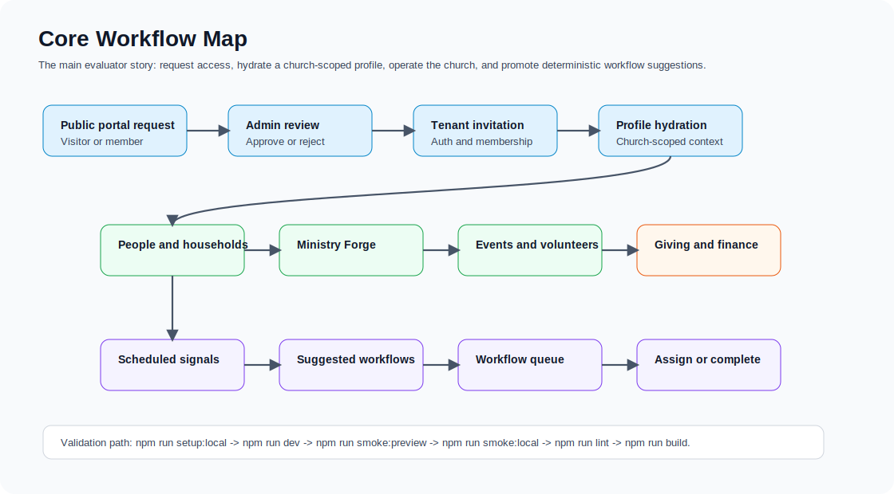

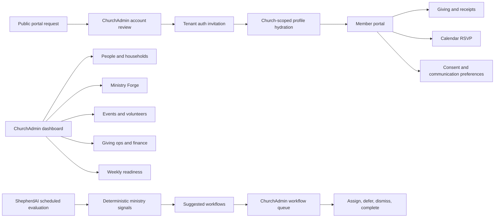

## Documentation Map

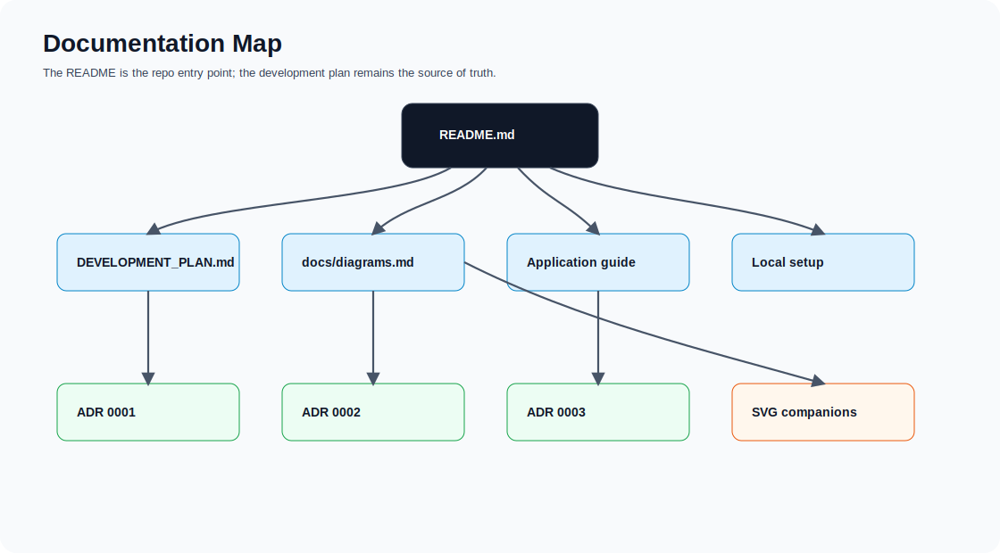

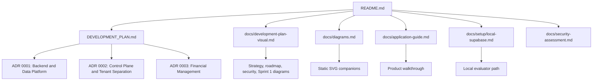

## Claude Code Software Factory

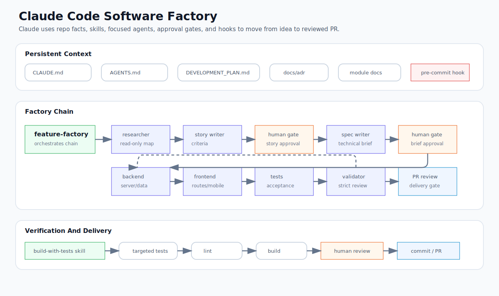

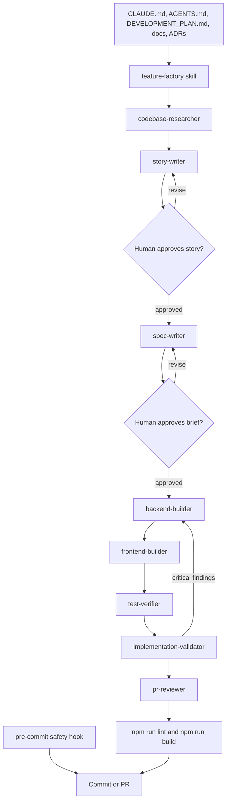

## Codex Software Factory

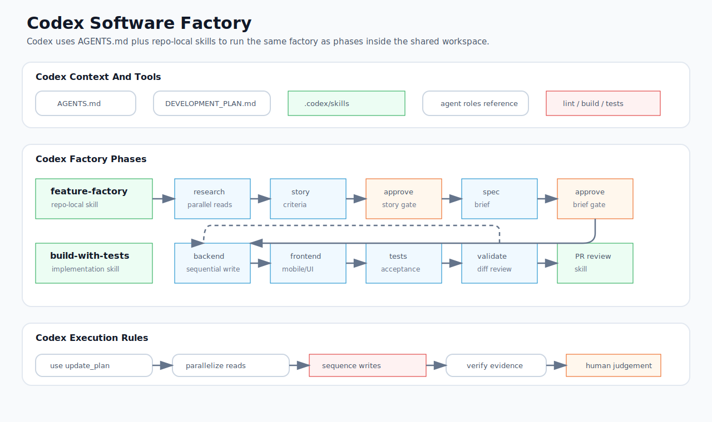

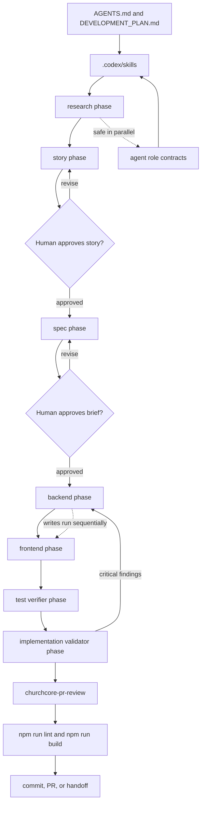
