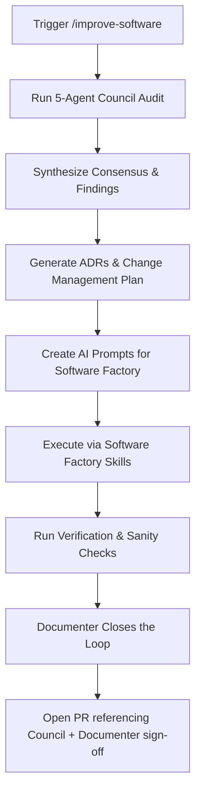

# IMPROVE-SOFTWARE — ChurchCore Council Review & Software Factory Protocol

This protocol defines the repeatable cycle of **auditing code (via the 5-agent audit Council)**, **planning changes (via ADRs and Change Management)**, **executing features/fixes (via the Software Factory)**, and **closing the loop (via the Documenter)** to keep the ChurchCore platform aligned with enterprise-grade MVP, security, and performance standards.

## 0. Mandate

**The Council runs before every merge to `main`.** This is not optional for meaningful work — see `AGENTS.md`. Any PR of non-trivial size (new feature, schema change, security-relevant change, or an accumulated multi-commit branch) must have a council pass and Documenter sign-off referenced in the PR description before merge. Small, isolated fixes (typo, single-line config, dependency bump with no behavior change) may skip it, but the exception is the branch being small — not the reviewer being in a hurry.

The Council is six agents (Council v2, adopted 2026-10-02):

- **Agents 1–5** (below): read-only audit — data/API, routes/pages, UX/shell, feature/competitive, and **security**. Security became its own seat in v2: across Council Reviews 17–38, security findings (`SECURITY DEFINER` actors, webhooks failing open, actions with no gate, unauthenticated proofs) recurred while folded into the data/API seat.
- **Agent 6 — Documenter**: write role, runs after synthesis and after factory execution verifies cleanly. Closes the loop that agents 1–5 cannot: updates `DEVELOPMENT_PLAN.md`, `CHANGELOG.md`, README/docs, finalizes ADRs, commits the council's own output, and writes memory. See `.claude/agents/documenter.md` for the full contract; Codex and Gemini surfaces invoke the same role via `.codex/skills/churchcore-council/SKILL.md` and `.gemini/skills/gemini-council/SKILL.md`.

Past council rounds (1–8, see `docs/reviews/`) ran the audit and synthesis phases but never had a Documenter step — which is why `DEVELOPMENT_PLAN.md` and other docs drifted out of sync with what actually shipped. Do not repeat that gap.

---

## 1. The Improvement Command Cycle

Whenever you need to verify, plan, or improve the ChurchCore software (at the end of a sprint, after major changes, or before a new release), trigger the `/improve-software` workflow:



1. **Audit (Council):** Spawn 5 read-only agents in parallel using the prompts defined below to inspect data and API state, page routing, UX quality, feature completeness, and security. Each is a separate agent with its own brief: one model voting as several seats in a single response is not a Council.
2. **Synthesize:** Group findings into consensus items, list architectural decisions, and outline the sequence of work.
3. **ADRs:** Generate Architectural Decision Records (ADRs) for any new boundaries, role access helpers, integration contracts, or data exposure rules under `docs/adr/`.
4. **Change Management:** Map out the prompts into sequential tasks and track them via repo-local Planning Mode artifacts (`implementation_plan.md`, `task.md`, `walkthrough.md`).
5. **Software Factory Execution:** Hand off the concrete, self-contained AI prompts to the software factory (`feature-factory` / `build-with-tests` on Claude, `gemini-feature-factory` / `gemini-build-with-tests` on Gemini, `churchcore-feature-factory` / `churchcore-build-with-tests` on Codex) to implement the changes to professional standards.
6. **Documentation Close-Out (Documenter):** Once verification (`npm test`, `npm run lint`, `npm run build`) is clean, run the Documenter agent (Agent 6) to update the plan, changelog, docs, ADRs, and memory, and to confirm the council's own reports are committed. See Phase 4 below.
7. **PR:** Only after the Documenter step does the branch open a PR, referencing the council synthesis and confirming Documenter sign-off in the description.

---

## 2. Phase 1: Spawning the Council (Audit Prompts)

Copy these prompts verbatim when spawning the council. Replace `[REPO_ROOT]` with the absolute workspace path.

### Agent 1 — Data & API Audit

```
You are Council Agent 1 for ChurchCore. Your job is a data and API state audit: schema hygiene, migrations, data integrity and concurrency. (Security is Agent 5's seat.) READ-ONLY — do not edit any files.

Repo root: [REPO_ROOT]

Produce a structured report covering:

1. Migrations — count all CREATE TABLE statements in supabase/migrations/. List each table, whether it has Row Level Security (RLS) enabled, and flag any tables that have no corresponding references in the TypeScript application files.

2. Lib & Server Utilities — list major directories under lib/ (e.g., lib/communications/, lib/supabase/, lib/shepherd-ai/). For each: note key types and check if there are matching repository/service files and unit/integration tests present under tests/ or near the source. Flag gaps.

3. API Routes — list every file under app/api/ (e.g., app/api/ai/route.ts, app/api/demo/feedback/route.ts). Note HTTP method from export names.

4. App Pages — list every page.tsx under app/. Flag any that call redirect() instead of rendering content and any that are empty stubs.

5. Seed data — check supabase/migrations/ or seed files for seed INSERT statements. Is the demo/seed dataset realistic? What is missing?

6. Migrations — is each new migration backwards-compatible with the code running before it deploys (no dropped or renamed column still read, no new NOT NULL without a default)? Does it state how it would be rolled back? Are writes that must happen together (a ledger post, a claim and its marker) in one transaction or otherwise race-safe?

7. Top 5 critical missing pieces for data integrity and MVP completeness — be specific and honest.

Return concise structured markdown. Target 500–700 words.
```

### Agent 2 — Route & Page Audit

```
You are Council Agent 2 for ChurchCore. Your job is a route and page audit. READ-ONLY — do not edit any files.

Repo root: [REPO_ROOT]

1. Shell nav inventories — read components/application/app-shell.tsx, components/application/member-bottom-nav.tsx, and components/application/reports-shell.tsx. List every nav href.

2. Page existence check — for every href, verify whether a page.tsx exists in app/. Mark each: EXISTS / STUB (calls redirect or <5 lines) / MISSING (404).

3. API route completeness — for every client form or button that does a fetch/POST/PATCH/DELETE, verify the corresponding API route exists under app/api/. Report any orphaned handlers.

4. Link consistency — look for hardcoded hrefs in page files that point to routes not covered by existing pages.

5. Summary table — | Route | Shell | Page Status | Notes |

Return concise structured markdown. Be specific — name every 404 and stub. Target 400–600 words.
```

### Agent 3 — UX & Shell Audit

```
You are Council Agent 3 for ChurchCore. Your job is a UX and shell quality audit. READ-ONLY — do not edit any files.

Repo root: [REPO_ROOT]

1. ARIA correctness — scan shell components and key page files (using Mantine and Lucide components). Check: aria-expanded, aria-selected, aria-label, aria-current. Flag strings used where booleans are needed, or missing where required.

2. Loading and empty states — for each major church-admin, pastor, giving, finance, and member page, does it handle empty data collections gracefully? Is there a loading skeleton or Mantine Loader? Does it crash on empty arrays?

3. CSS/Styling completeness — read next.config.ts, postcss.config.mjs, and look for global CSS styles. Are referenced CSS classes defined? Is there mobile responsiveness?

4. Shell nav active state — how does each layout identify the active nav item? Is it implemented consistently across app-shell and member-bottom-nav?

5. Error handling — are there error.tsx files at app/ level or layout levels? Do server components handle DB errors or let them bubble and crash?

6. Top 3 UX pain points a real user would hit today.

Return concise structured markdown. Be specific. Target 400–600 words.
```

### Agent 4 — Feature & Competitive Audit

```
You are Council Agent 4 for ChurchCore. Your job is feature completeness and competitive gap analysis. READ-ONLY — do not edit any files.

Repo root: [REPO_ROOT]

Read first:
- [REPO_ROOT]/DEVELOPMENT_PLAN.md
- [REPO_ROOT]/docs/security-role-access-matrix.md
- [REPO_ROOT]/docs/tenant-data-segmentation.md

Then audit the actual implementation:

1. Workflow completion — check the progress of the core ChurchCore modules (Member Care, Volunteer Scheduling, Children's Check-in, Events & Registrations, Giving & Finances, Communications, and AI Governance). Give % for each.

2. User role coverage — rate 0–100% role-based access validation for: Super-Admin (Control Plane), Church-Admin, Pastor, Secretary, Ministry-Leader, Teacher, Member.

3. Core operations workflows — rate completeness for: Child Checkin/Checkout Security, Double-entry general ledger, Resend/Twilio dispatch with suppression rules, Impersonation gates, and ADR/HQ Governance logging.

4. Competitive gap — vs. Planning Center Online (PCO), Breeze ChMS, Tithe.ly: the 5 most critical feature/compliance gaps preventing adoption today.

5. MVP readiness score — 0–100 with justification. Be honest.

Return concise structured markdown. Be honest and direct. Target 500–700 words.
```

### Agent 5 — Security Audit

```
You are Council Agent 5 for ChurchCore. Your job is a security audit. READ-ONLY — do not edit any files.

Repo root: [REPO_ROOT]

Threat-model the scope under review. For every finding give the file:line, the concrete attack or failure, and a fix; mark anything you could not verify as UNVERIFIED.

1. Authorization — does every "use server" export and API route authenticate its own caller and check the role? Does any take a church, profile or actor id from the caller instead of the session (see memory: server-only vs "use server"; login id vs church profile id)?

2. Tenant isolation — does every read and write through an admin (service-role) client scope by church (ADR 0022)? Can one church read or change another's rows?

3. RLS — for every new or changed table: RLS enabled, anon revoked, no client write path the server doesn't intend, no column (e.g. a profile id on an anonymous row) that a direct query could use to defeat masking the UI does on the server.

4. SECURITY DEFINER functions — does any take its actor from an argument instead of auth.uid() (ADR 0024)? Who can EXECUTE it (check grants to anon/authenticated/public)?

5. Unauthenticated surfaces — webhooks (signature verified, fail closed with no secret, replay window), public actions (rate limits, what proof stands in for a session), demo/stub routes (gated to demo mode).

6. Secrets and PII — keys never reach the client, PII scrubbed before third parties (e.g. the LLM), audit-log entries for privileged changes.

7. Top 5 security risks in scope, ranked.

Return concise structured markdown. Target 500–800 words.
```

---

## 3. Phase 2: Synthesis & Change Management

After receiving all 5 agent reports, the synthesis step must produce:

### 0. Status and claim verification
Open the synthesis with a **Status**: `RATIFIED` (ready as built), `AMENDED` (ready once the listed fixes land), or `REJECTED` (back to design). The status is the Council's recommendation; the owner decides.

Check every agent claim against the source (or by computation, for contrast and wire formats) before adopting it, and list the claims that proved wrong or unsupported. Agents have made wrong claims in nearly every round; a finding that isn't verified isn't a finding.

### 1. Cross-Agent Consensus
List findings that multiple agents independently flagged. These are highest priority.

### 2. ADR Drafts
For every architectural decision the council identifies (new boundary, new pattern, new constraint), draft an ADR following the format in `docs/adr/`. Assign the next sequential number.

*ADR triggers:*
- A new module pattern or boundary (e.g., how error.tsx is structured)
- A new role-based access pattern
- A new integration contract
- A new data exposure rule

### 3. Implementation Prompts
For every agreed-upon change, write a concrete implementation prompt using this template:

```
## Prompt [LETTER] — [SHORT TITLE]

**ADR Reference:** ADR-XXXX (if applicable)
**Files:** [comma-separated list of files to create or modify]
**Scope:** [1–3 sentences describing exactly what to build]

**Work:**
1. [Specific step]
2. [Specific step]
...

**Verification:**
- npm test
- npm run lint
- npm run build
- [Any additional checks]
```

### 4. Execution Order
List prompts in dependency order. Note which are independent (can run in parallel) and which must be sequential.

---

## 4. Phase 3: Software Factory Processing (Good Standards)

Every prompt generated by the council review must be executed through the repo-local software factory for whichever surface is running the session: `feature-factory` / `build-with-tests` under `.claude/skills/` on Claude Code, `churchcore-feature-factory` / `churchcore-build-with-tests` under `.codex/skills/` on Codex, or `gemini-feature-factory` / `gemini-build-with-tests` under `.gemini/skills/` on Gemini (Antigravity).

### Code Quality & Implementation Standards
- **Zero Impurity/Render Violations:** Never call impure functions (e.g., `Date.now()`, `Math.random()`, or async operations) inside React component render loops or `useRef` initializations. Use `useEffect` or React hooks wrappers to isolate side effects.
- **Tenant Database Isolation:** Ensure the control-plane and tenant data surfaces are strictly isolated. All tenant actions must use supabase server/admin connections resolved via church profile sessions.
- **Row Level Security (RLS):** All database changes must enforce RLS check policies utilizing the `current_user_role()` context. Run `npm run audit:rls` to verify schema constraints.
- **Doc Integrity:** Retain existing comments, type boundaries, and docstrings that are unrelated to your changes.
- **No Push to main:** Never commit code directly to `main`. Create a feature branch, run testing suites, and verify via a Pull Request.

### Sanity Checks Before Delivery
Before handing work back to the user, the agent must run:
1. `npm run test` (Vitest) and `npm run test:surfaces` (coverage manifest), plus `npm run test:e2e:local` (Playwright, every page × every role and every API route) when pages, routes, or actions changed. See `docs/testing.md`.
2. `npm run lint` to guarantee zero ESLint rules violations.
3. `npm run build` to verify next-compilation builds successfully without compiler exceptions.
4. For any branch with a migration: `npm run lint:migrations`; the migration applies to a freshly reset database (`./supabase/scripts/setup-e2e.sh --reset`, as CI does); it is backwards-compatible with the code running before it deploys; and its rollback is stated (in the migration's comments or the PR).

Only once these are clean does the branch move to Phase 4. A red build or failing test is a stop condition, not a Documenter task.

---

## 5. Phase 4: Documentation Close-Out (Documenter)

The Documenter (Agent 6) runs once Phase 3's sanity checks are clean and before a PR is opened. It is a write role, unlike Agents 1–5.

**Task:** Make the finished, verified work legible to everyone who reads the repo without having read this conversation.

**Inputs:** the council synthesis, any ADRs drafted in Phase 2, the actual diff/`git log` of what was built, and the Phase 3 verification results.

**Work:**
1. Update `DEVELOPMENT_PLAN.md` — correct sprint status, exit criteria, and the "Next Sprint" note to match what actually shipped. Do not leave this file describing a sprint that already closed.
2. Add a `CHANGELOG.md` entry under `[Unreleased]` in the repo's existing style.
3. Update `README.md` and any affected `/docs` pages for meaningful user-facing or architectural changes.
4. Finalize any ADR left in draft form from Phase 2 — every ADR a synthesis references must exist and be numbered correctly.
5. Confirm the council's own `docs/reviews/` output (see below) is committed, not just generated.
6. Update the project's auto-memory (`project`/`feedback` entries and `MEMORY.md` index) with anything future sessions need — new mandates, decisions, recurring gotchas. Skip anything derivable from code or git history.
7. Write one committed handoff note (PR description or `docs/factory-runs/` entry) covering intent, architecture impact, verification commands/results, residual risk, and follow-up work, per `AGENTS.md`.

**Stop condition:** if the Documenter finds status it cannot verify (no passing test, no green build, a claim with no evidence in the diff), it reports that instead of marking it done.

On Claude Code, invoke this as the `documenter` subagent (`.claude/agents/documenter.md`). On Codex and Gemini, the equivalent instructions live in `.codex/skills/churchcore-council/SKILL.md` and `.gemini/skills/gemini-council/SKILL.md`.

---

## Output Location

After each council run, commit the following:

- `docs/reviews/YYYY-MM-DD-council-review-[N]-synthesis.md` — full synthesis with prompts
- `docs/reviews/YYYY-MM-DD-council-review-[N]-agents-1-5.md` — the agent reports (from Council v2; rounds before it have four)
- `docs/adr/XXXX-*.md` — any new ADRs drafted by the council
- Documenter's updates to `DEVELOPMENT_PLAN.md`, `CHANGELOG.md`, `README.md`, `/docs`, and memory (Phase 4)

The Documenter owns confirming all of the above are actually committed before the PR opens — a council run is not complete when the last agent report is written, it is complete when this list is true on disk.

---

## 6. The in-app LLM Council (Project HQ)

Project HQ (`/hq`, platform staff only) has its own **Council mode**, wired to an LLM through `/api/ai`. It runs the same five audit seats as **separate model calls**, each with its seat's brief (`lib/council/seats.ts`), in parallel, then one synthesis call that drafts a `RATIFIED` / `AMENDED` / `REJECTED` recommendation for the owner, and saves the run with HQ's sessions.

What it is for: a quick, structured second opinion on a proposal, decision or risk written in HQ, with HQ's own register (tasks, risks, decisions) as context.

What it is not: the code-reading Council. The in-app Council sees only the text it's given and HQ's register; it cannot read the repository, run tests, or verify a claim against source. The merge mandate in §0 is met only by this protocol's agents reading the code. The portable description of both is `docs/council-and-hq-portable.md`.
